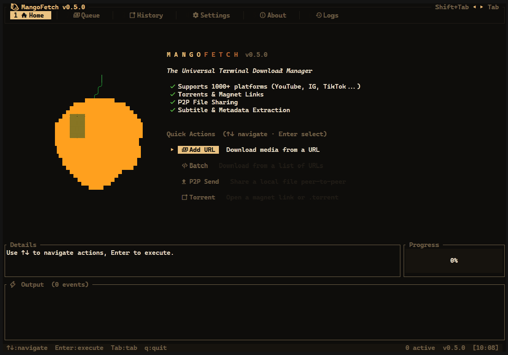
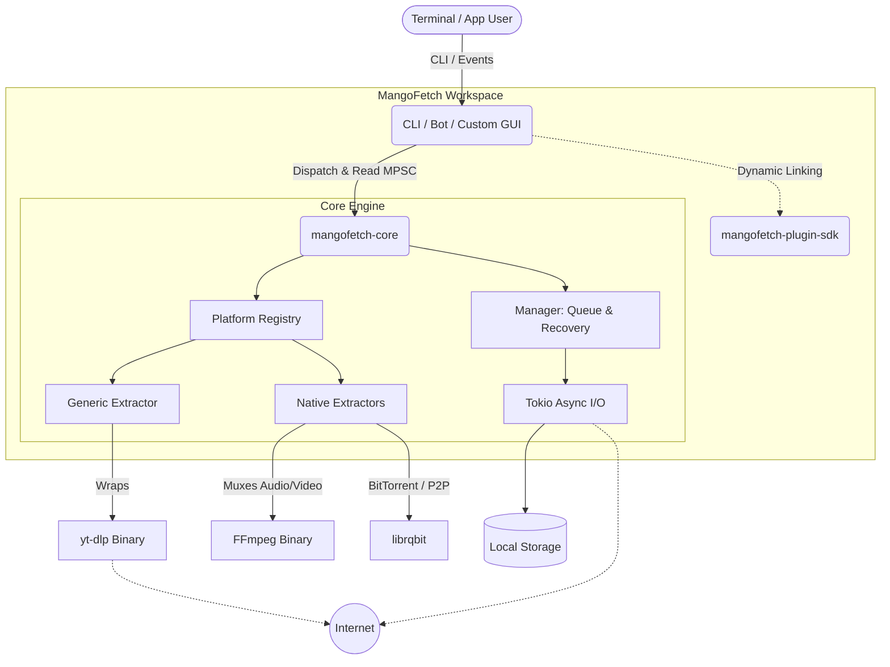
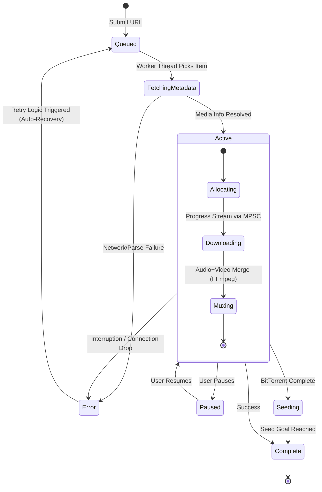

<table border="0">
  <tr>
    <td width="200" align="center" valign="top">
      
    </td>
    <td valign="top">
      <h1>mangofetch</h1>
      <p><strong>Fast, Tropical, Pure Rust.</strong><br/>
      <em>A headless, UI-agnostic download engine SDK & TUI/CLI frontend</em></p>
      <p>
        <a href="https://crates.io/crates/mangofetch-cli"></a>
        <a href="LICENSE"></a>
        
        
        
      </p>
    </td>
  </tr>
</table>

---
<p align="center">
  
</p>

___

<!--toc:start-->
- [mangofetch](#mangofetch)
  - [Overview](#overview)
  - [Using as a Rust SDK (mangofetch-core)](#using-as-a-rust-sdk-mangofetch-core)
  - [CLI/TUI Installation](#clitui-installation)
  - [Key Features (v0.5.1)](#key-features-v051)
  - [Technical Architecture](#technical-architecture)
  - [The Core Engine Lifecycle](#the-core-engine-lifecycle)
  - [Command Reference](#command-reference)
  - [Roadmap & Milestones](#roadmap--milestones)
  - [Acknowledgments](#acknowledgments)
  - [Contributing](#contributing)
  - [License](#license)
<!--toc:end-->

## Overview

At its heart lies **`mangofetch-core`**, a raw, low-latency, and **headless download engine**. Built upon **Tokio** and **Reqwest**, it exposes a universal API via clean Rust Traits to interact with YouTube, Torrents (Magnet), SoundCloud, Instagram, and over 1000+ platforms via dynamic `yt-dlp` and `ffmpeg` integration.

For end-users, MangoFetch ships with **`mangofetch-cli`**, our reference implementation.

___

<p align="center">
  
</p>

---

## Using as a Rust SDK (mangofetch-core)

Unlike monolithic GUI downloaders, **MangoFetch is designed to be embedded**. If you are building a Discord bot, a web server, or your own custom GUI, you can drop `mangofetch-core` directly into your Rust project. 

Add it to your `Cargo.toml`:
```toml
[dependencies]
mangofetch-core = { git = "https://github.com/julesklord/mangofetch-cli" }
```

**Why use `mangofetch-core`?**
* **UI-Agnostic Telemetry:** Progress reporting is handled entirely through standard `tokio::sync::mpsc` channels. No UI thread blocking, no tight coupling to webviews or terminal crates.
* **Unified Trait System:** Whether it's a direct link, a magnet URI, or a TikTok video, you interface with them through the exact same `PlatformDownloader` trait.
* **Zero-Touch Dependencies:** The engine automatically downloads, manages, and verifies external binaries like `yt-dlp` and `ffmpeg` within its sandbox. You don't have to worry about the user's `$PATH`.
* **Resilient Queue:** A fault-tolerant download manager that handles retries, rate limits (429s), and network drops autonomously.

---

## CLI/TUI Installation

### Via Cargo (Recommended)

The fastest way to install the CLI directly to your system path:

```zsh
cargo install mangofetch-cli
```

### From Source

For developers who want the absolute bleeding edge:

```zsh
git clone https://github.com/julesklord/mangofetch-cli.git
cd mangofetch-cli
cargo build --release
# The compiled binary will be available at: target/release/mangofetch
```

---

## Key Features (v0.5.1)

*   **1000+ Platforms**: Deep, zero-overhead integration with `yt-dlp` to support virtually any media portal on the internet.
*   **Headless Core**: A highly decoupled architecture allowing the download engine to be used as a standalone Rust crate.
*   **Interactive TUI**: A highly responsive, full-screen dashboard powered by `ratatui`, featuring **11 Tropical Fruit Themes** (Mango, Pitaya, Guayaba, Passionfruit, and more).
*   **Fluid Mouse Support**: Full support for pointer events—scroll through sprawling download queues and actuate tabs directly via mouse telemetry.
*   **Vim-Style Commands**: For the ultimate power user, actuate ultra-fast, non-blocking operations via the `:` command buffer.
*   **P2P & Torrents**: Native protocol implementations for magnet links and peer-to-peer decentralized file sharing.
*   **Intelligent Extraction Engine**: Features multi-segment HTTP downloads, staggered connection starts to bypass rate limits, and zero-copy metadata embedding.

---

## Technical Architecture

MangoFetch is rigorously organized as a modular workspace, enforcing strict separation of concerns. This architectural decision ensures the core engine remains portable, highly testable, and isolated from the rendering layer.



### Core Components

- **`mangofetch-core`**: The UI-agnostic heartbeat of the system. It governs the asynchronous download queue, orchestrates connection pooling, and houses the platform-specific native extractors (YouTube, Instagram, TikTok, etc.). It intelligently encapsulates `yt-dlp` and `ffmpeg` for complex stream muxing, automatically provisioning these binaries if omitted from the host `$PATH`.
- **`mangofetch-cli`**: A hyper-lightweight frontend built with `clap` and `ratatui`. It acts as a highly optimized dispatcher consuming the core library, rendering real-time telemetry via a brutalist, information-dense ANSI interface or the interactive TUI.
- **`mangofetch-plugin-sdk`**: A robust FFI-compatible SDK engineered to extend MangoFetch's capabilities dynamically at runtime via shared libraries (`.so` / `.dll`).

---

## The Core Engine Lifecycle

The `mangofetch-core` queue is intrinsically fault-tolerant. Operating on a resilient asynchronous loop, if a single task in a 10,000-item batch encounters a network anomaly, the queue isolates the failure, initiates exponential backoff retries, and continues processing the matrix without stalling.



### Key Engineering Milestones

- **Asynchronous I/O Pipeline:** Built upon `tokio::sync::mpsc` channels for non-blocking progress reporting. The UI rendering thread is completely decoupled from the heavy I/O threads, guaranteeing fluid terminal refreshes.
- **Self-Healing Dependencies:** Automatic checksum validation, resolution, downloading, and path-linking of external binaries (`ffmpeg`, `yt-dlp`).
- **Intelligent Parser Heuristics:** The Platform Registry attempts to natively parse media using zero-cost abstractions, falling back to generic extractors only when mathematically necessary.

---

## Command Reference

For a comprehensive breakdown of all execution flags, API arguments, and TUI keybindings, please consult our **[Official Engineering Wiki](docs/wiki/Home.md)**.

*   **[Installation Guide](docs/wiki/Installation.md)**
*   **[CLI Command Reference](docs/wiki/CLI-Guide.md)**
*   **[TUI Interactive Guide](docs/wiki/TUI-Experience.md)**
*   **[Technical Architecture](docs/wiki/Architecture.md)**

| Full Command                          | Short Alias _(Upcoming)_ | Description                                             |
| :------------------------------------ | :----------------------- | :------------------------------------------------------ |
| `mangofetch download <url>`           | `mango d <url>`          | Single file payload extraction and download.            |
| `mangofetch download-multiple <file>` | `mango dm <file>`        | High-throughput batch archival from a manifest file.    |
| `mangofetch info <url>`               | `mango i <url>`          | Perform media metadata telemetry without touching disk. |
| `mangofetch list`                     | `mango ls`               | Inspect current active queue and historical matrix.     |
| `mangofetch clean`                    | `mango c`                | Clear persistent download history and purge cache.      |
| `mangofetch config`                   | `mango cfg`              | Manage engine parameters, connection limits, and paths. |
| `mangofetch check`                    | `mango ch`               | Verify cryptographic integrity of system dependencies.  |
| `mangofetch update`                   | `mango up`               | Upgrade internal dependency binaries to latest hashes.  |
| `mangofetch logs`                     | `mango log`              | Tail raw asynchronous application logs for debugging.   |
| `mangofetch about`                    | `mango a`                | Display engine version, license, and telemetry data.    |

---


## Roadmap & Milestones

| Version    | Status | Milestone                                                       |
| ---------- | ------ | --------------------------------------------------------------- |
| **v0.1.0** | ✅     | Initial release and asynchronous architecture setup             |
| **v0.2.0** | ✅     | Standalone rewrite — GUI stripped, core engine highly optimized |
| **v0.3.1** | ✅     | Rebranding cleanup, test matrix fixes, and documentation        |
| **v0.4.0** | ✅     | **The TUI Release:** Full-screen interactive terminal interface |
| **v0.5.1** | ✅     | **UX & Polish:** Tropical themes, pointer support, dynamic UI   |
| **v0.6.0** | ⏳     | Plugin management and community extractors via FFI SDK          |
| **v0.7.0** | ⏳     | Decentralized P2P swarm integration                             |

---

## Acknowledgments

- **[OmniGet](https://github.com/tonhowtf/omniget)** — The absolute backbone of this project. A huge shoutout to _tonhowft_ for architecting the original extraction logic and queue engine that MangoFetch builds upon.
- **[yt-dlp](https://github.com/yt-dlp/yt-dlp)** — The incredible extraction engine handling the heavy lifting for over a thousand unsupported platforms.

## Contributing

Pull requests are fiercely welcomed. We adhere to rigorous engineering standards. For major architectural permutations, please open an RFC issue first to discuss your algorithm and approach. See `CONTRIBUTING.md` for guidelines.

## License

<p align="center">
  Engineered by <a href="https://github.com/julesklord">Jules Martins</a>.<br>
  Released under the terms of the GPL-3.0 License.
</p>
