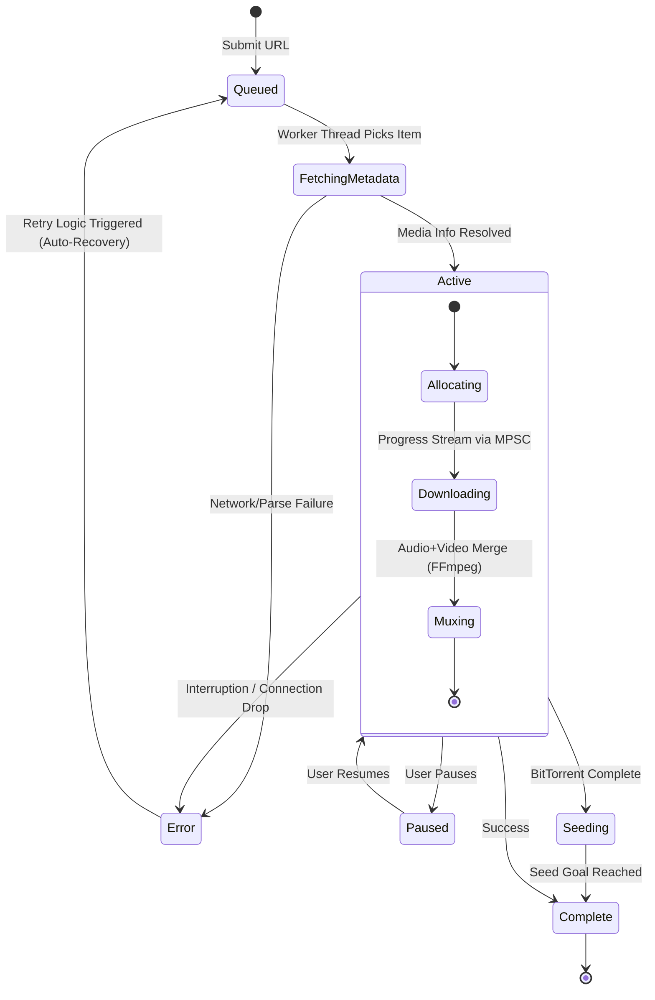

<table border="0">
  <tr>
    <td width="200" align="center" valign="top">
      
    </td>
    <td valign="top">
      <h1>mangofetch</h1>
      <p><strong>Fast, Tropical, Pure Rust.</strong><br/>
      <em>A headless, UI-agnostic download engine SDK & GUI/TUI/CLI frontend suite</em></p>
      <p>
        <a href="https://crates.io/crates/mangofetch-cli"></a>
        <a href="LICENSE"></a>
        
        
        
      </p>
    </td>
  </tr>
</table>

---

<p align="center">
  
</p>

___

<!--toc:start-->
- [Overview](#overview)
- [Cross-Platform Compatibility](#cross-platform-compatibility)
- [Using as a Rust Library (mangofetch-core)](#using-as-a-rust-library-mangofetch-core)
- [Installation](#installation)
  - [Via Cargo (Recommended)](#via-cargo-recommended)
  - [From Source](#from-source)
  - [Run](#run)
- [Technical Architecture](#technical-architecture)
  - [Core Components](#core-components)
- [How the Engine Works](#how-the-engine-works)
  - [Key Features under the hood](#key-features-under-the-hood)
- [Command Reference](#command-reference)
- [Acknowledgments](#acknowledgments)
- [Contributing](#contributing)
- [License](#license)
<!--toc:end-->

## Overview

**MangoFetch** is a fast, versatile, and comprehensive media downloader suite built in Rust. It's designed to be a complete tool out-of-the-box, providing maximum control and granular options (like specific video/audio formats and resolutions) without sacrificing speed or simplicity. 

At its heart is **`mangofetch-core`**, a lightweight and **headless engine**. Built on **Tokio** and **Reqwest**, it uses a simple API with Rust Traits to handle YouTube, Torrents (Magnet), SoundCloud, Instagram, and over 1000+ other platforms thanks to its intelligent wrapping of `yt-dlp` and `ffmpeg`.

For everyday use, MangoFetch ships with a complete frontend suite:
1. **`mangofetch-gui`**: A beautifully designed, highly-responsive, hardware-accelerated desktop application powered by `egui`. It features a dark-industrial MonolithUI design system, persistent engine logs, telemetry, and drag-and-drop ease.
2. **`mangofetch tui`**: A terminal dashboard built with `ratatui` featuring mouse support, modal dialogs, queue management, and 11 fun Tropical Fruit color palettes.
3. **`mangofetch cli`**: A rapid, scriptable command-line interface for batch downloads and single-shot commands.

## Cross-Platform Compatibility

MangoFetch is built in Pure Rust, guaranteeing native performance and ubiquitous compatibility. The entire suite (Core, GUI, TUI, and CLI) compiles and runs natively across a wide range of architectures and operating systems:

- **Operating Systems:** Windows (10/11), macOS (Intel & Apple Silicon), GNU/Linux (Ubuntu, Arch, Fedora, Arch, Alpine, etc.), and *BSD variants.
- **Architectures:** AMD64 (x86_64), ARM64 (aarch64), ARMv7, making it perfect for powerful desktops, MacBooks, and even Raspberry Pi or low-power home servers.
- **Self-Healing:** If your system is missing `yt-dlp`, `ffmpeg`, or `aria2c`, the MangoFetch engine can detect your OS and architecture and securely download the correct standalone binaries automatically. You don't need to manually configure PATH dependencies.

___

<p align="center">
  
</p>

---

## Using as a Rust Library (mangofetch-core)

Unlike big, clunky GUI downloaders, **MangoFetch is built to be part of your project**. If you're making a Discord bot, a web server, or your own custom app, you can just plug `mangofetch-core` right into your Rust code.

Add it to your `Cargo.toml`:
```toml
[dependencies]
mangofetch-core = { git = "https://github.com/julesklord/mangofetch" }
```

**Why use `mangofetch-core`?**
* **Simple Telemetry:** Check progress easily using standard `tokio::sync::mpsc` channels. No UI blocking or complicated setup needed.
* **Unified Traits:** Whether it's a direct link, a torrent, or a TikTok video, you can talk to them all through the same `PlatformDownloader` trait.
* **Easy Dependencies:** The engine takes care of managing and checking external tools like `yt-dlp` and `ffmpeg` in its own space.
* **Reliable Queue:** A smart download manager that handles retries and network hiccups automatically.

---

## CLI/TUI Installation

### Via Cargo (Recommended)

The fastest way to install the CLI directly to your system path:

```zsh
cargo install mangofetch
```

### From Source

For developers who want the absolute bleeding edge:

```zsh
git clone https://github.com/julesklord/mangofetch.git
cd mangofetch
cargo build --release
# The compiled binary will be available at: target/release/mangofetch
```

### Run
```zsh
mangofetch <command> <link>
```

```zsh
mangofetch tui (run the tui interactive dashboard)
```

---

## Technical Architecture

MangoFetch is well-organized, keeping things clean and modular. This design makes the core engine portable, easy to test, and separate from how it's shown on screen.


### Core Components

- **`mangofetch-core`**: The heart of the system. It handles the download queue and works with sites like YouTube, Instagram, and TikTok. It also manages `yt-dlp` and `ffmpeg` for you, even downloading them if they aren't on your system.
- **`mangofetch`**: A simple frontend built with `clap` and `ratatui`. It's fast, looks great, and shows you everything that's happening in real-time.
- **`mangofetch-plugin-sdk`**: A toolkit for adding new features to MangoFetch while it's running.

---

## How the Engine Works

The `mangofetch-core` queue is smart and reliable. It handles many downloads at once, and if something goes wrong with one, it just retries later without stopping everything else.



### Key Features under the hood

- **Fast Progress Reporting:** Uses background channels to show progress without slowing down the app. This keeps the interface smooth and responsive.
- **Self-Healing Tools:** Automatically finds and sets up the external tools it needs (`ffmpeg`, `yt-dlp`).
- **Smart Parsing:** Tries to handle links directly first, only using extra tools when it really needs to.

---

## Command Reference

For a full list of commands and how to use the TUI, check out our **[Official Wiki](docs/wiki/Home.md)**.

*   **[Installation Guide](docs/wiki/Installation.md)**
*   **[CLI Command Reference](docs/wiki/CLI-Guide.md)**
*   **[TUI Interactive Guide](docs/wiki/TUI-Experience.md)**
*   **[Technical Architecture](docs/wiki/Architecture.md)**

| Full Command                          | Short Alias _(Upcoming)_ | Description                                             |
| :------------------------------------ | :----------------------- | :------------------------------------------------------ |
| `mangofetch download <url>`           | `mango d <url>`          | Just download a single link.                            |
| `mangofetch download-multiple <file>` | `mango dm <file>`        | Download a whole bunch of links from a file.            |
| `mangofetch info <url>`               | `mango i <url>`          | See info about a link without downloading it.           |
| `mangofetch list`                     | `mango ls`               | See what's currently in your queue.                     |
| `mangofetch clean`                    | `mango c`                | Clear your history and cache.                           |
| `mangofetch config`                   | `mango cfg`              | Change settings like limits and paths.                  |
| `mangofetch check`                    | `mango ch`               | Check if your tools are working correctly.              |
| `mangofetch update`                   | `mango up`               | Update the external tools to their latest versions.     |
| `mangofetch logs`                     | `mango log`              | View app logs if you're curious or debugging.           |
| `mangofetch about`                    | `mango a`                | Show version and license info.                          |

---

## Acknowledgments

- **[OmniGet](https://github.com/tonhowtf/omniget)** — A big inspiration for this project. Huge thanks to _tonhowft_ for the original ideas and engine logic.
- **[yt-dlp](https://github.com/yt-dlp/yt-dlp)** — The amazing tool that does the heavy lifting for so many sites.

## Contributing

Pull requests are always welcome. We have a few rules to keep the code clean, so if you're planning a big change, just open an issue first so we can chat about it. Check out `CONTRIBUTING.md` for more info.

## License

<p align="center">
  Built by <a href="https://github.com/julesklord">Jules</a>, gemini-cli assistant and claude.<br>
  Released under the GPL-3.0 License.
</p>
