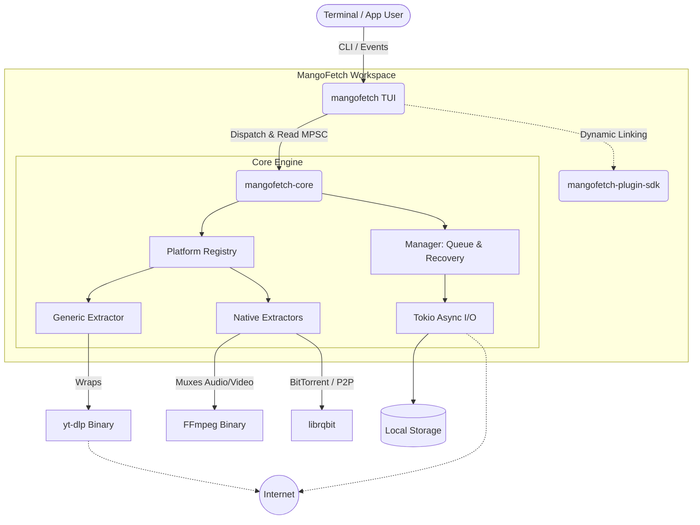
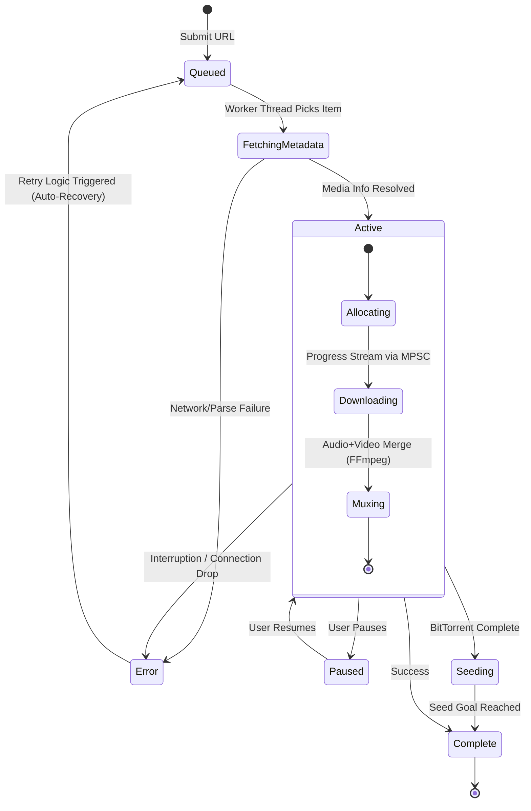

<table border="0">
  <tr>
    <td width="200" align="center" valign="top">
      
    </td>
    <td valign="top">
      <h1>mangofetch (TUI / Core)</h1>
      <p><strong>Fast, Tropical, Pure Rust.</strong><br/>
      <em>The core engine SDK and interactive Terminal User Interface (TUI) frontend of the mangoSuite.</em></p>
      <p>
        <a href="https://crates.io/crates/mangofetch"></a>
        <a href="LICENSE"></a>
        
        
        
      </p>
    </td>
  </tr>
</table>

---

<p align="center">
  
</p>

___

<!--toc:start-->
- [Overview](#overview)
- [The mangoSuite](#the-mangosuite)
- [Cross-Platform Compatibility](#cross-platform-compatibility)
- [Using as a Rust Library (mangofetch-core)](#using-as-a-rust-library-mangofetch-core)
- [TUI Installation & Run](#tui-installation--run)
  - [Via Cargo (Recommended)](#via-cargo-recommended)
  - [From Source](#from-source)
  - [Running the TUI](#running-the-tui)
- [Technical Architecture](#technical-architecture)
- [How the Engine Works](#how-the-engine-works)
- [Command Reference](#command-reference)
- [Acknowledgments](#acknowledgments)
- [Contributing](#contributing)
- [License](#license)
<!--toc:end-->

## Overview

MangoFetch downloads media quickly across multiple platforms. It provides granular control over video and audio formats without complex configuration.

The **`mangofetch-core`** engine uses Tokio and Reqwest to handle YouTube, Torrents, SoundCloud, and Instagram. It wraps `yt-dlp` and `ffmpeg` to support over 1000 platforms.

This repository contains:
1. **`mangofetch` (TUI)**: The interactive terminal frontend built with `ratatui`. Launches by default and supports mouse interaction, modal dialogs, and multiple color palettes.
2. **`mangofetch-core`**: The headless download engine.
3. **`mangofetch-plugin-sdk`**: The plugin SDK for extending the engine's capabilities.

## The mangoSuite

MangoFetch has been modularized into separate repositories for maximum flexibility:
* **[mangofetch](https://github.com/julesklord/mangofetch)** (This repo): Core engine SDK and interactive Ratatui TUI.
* **[mangofetch-cli](https://github.com/julesklord/mangofetch-cli)**: Scriptable, pure CLI frontend for headless execution and server batch jobs.
* **[mangofetch-gui](https://github.com/julesklord/mangofetch-gui)**: Hardware-accelerated desktop GUI built with `egui` & `eframe`.

## Cross-Platform Compatibility

MangoFetch runs natively on multiple architectures and operating systems. 

- **Operating Systems:** Windows (10/11), macOS (Intel and Apple Silicon), GNU/Linux, and BSD.
- **Architectures:** AMD64, ARM64, and ARMv7. It operates on desktops, MacBooks, and Raspberry Pi.
- **Dependency Management:** The engine detects missing binaries like `yt-dlp`, `ffmpeg`, or `aria2c`. It automatically downloads the correct standalone version for your OS.

___

<p align="center">
  
</p>

---

## Using as a Rust Library (mangofetch-core)

Integrate `mangofetch-core` directly into Discord bots, web servers, or custom applications.

Add it to `Cargo.toml`:
```toml
[dependencies]
mangofetch-core = "<version>"
```

**Engine Capabilities:**
* **Simple Telemetry:** Track progress via `tokio::sync::mpsc` channels.
* **Unified Traits:** Use the `PlatformDownloader` trait for links, torrents, and videos.
* **Dependency Automation:** The engine manages `yt-dlp` and `ffmpeg` binaries.
* **Recovery:** The download manager handles retries and network interruptions.

---

## TUI Installation & Run

### Via Cargo (Recommended)

Install the TUI to your system path:

```zsh
cargo install mangofetch
```

### From Source

```zsh
git clone https://github.com/julesklord/mangofetch.git
cd mangofetch
cargo build --release
```

### Running the TUI

Simply run the binary without any arguments to launch the interactive TUI directly:

```zsh
mangofetch
```

> [!NOTE]
> You can still pass traditional CLI commands to this binary (e.g., `mangofetch check`, `mangofetch info <url>`), but executing it empty launches the TUI immediately.

Set `MANGOFETCH_OFFLINE=1` to run tests without downloading external tools:

```bash
export MANGOFETCH_OFFLINE=1
cargo test -p mangofetch-core
```

---

## Technical Architecture

The modular design separates the core engine from the user interfaces.



### Core Components

- **`mangofetch-core`**: Manages the download queue and platform extractors. It handles binary dependencies automatically.
- **`mangofetch` (TUI)**: The interactive terminal frontend using `ratatui`.
- **`mangofetch-plugin-sdk`**: A toolkit for extending features at runtime.

---

## How the Engine Works

The queue processes multiple items concurrently. It isolates failures and triggers automatic retries.



### Internal Features

- **Progress Reporting:** Background channels provide updates without blocking the UI.
- **Binary Provisioning:** Locates and configures `ffmpeg` and `yt-dlp`.
- **Smart Parsing:** Prioritizes native extraction over external wrappers.

---

## Command Reference

View the **[Official Wiki](docs/wiki/Home.md)** for details.

*   **[Installation Guide](docs/wiki/Installation.md)**
*   **[CLI Command Reference](docs/wiki/CLI-Guide.md)**
*   **[TUI Interactive Guide](docs/wiki/TUI-Experience.md)**
*   **[Technical Architecture](docs/wiki/Architecture.md)**

| Command                          | Alias | Description                                             |
| :------------------------------- | :---- | :------------------------------------------------------ |
| `mangofetch download <url>`      | `mango d` | Download a single link.                                 |
| `mangofetch download-multiple`   | `mango dm`| Process links from a file.                              |
| `mangofetch info <url>`          | `mango i` | View metadata without downloading.                      |
| `mangofetch list`                | `mango ls`| View current queue.                                     |
| `mangofetch clean`               | `mango c` | Clear history and cache.                                |
| `mangofetch config`              | `mango cfg`| Modify limits and paths.                                |
| `mangofetch check`               | `mango ch`| Verify external tool status.                            |
| `mangofetch update`              | `mango up`| Update external binaries.                               |
| `mangofetch logs`                | `mango log`| View debug logs.                                        |
| `mangofetch about`               | `mango a` | Show version and license.                               |

---

## Acknowledgments

- **[OmniGet](https://github.com/tonhowtf/omniget)** — Inspired the original engine logic.
- **[yt-dlp](https://github.com/yt-dlp/yt-dlp)** — Handles core extraction.

## Contributing

Submit pull requests for features or fixes. Open an issue first for major changes. See `CONTRIBUTING.md` for details.

## License

<p align="center">
  Built by <a href="https://github.com/julesklord">Jules</a> and Claude.<br>
  Released under the GPL-3.0 License.
</p>
