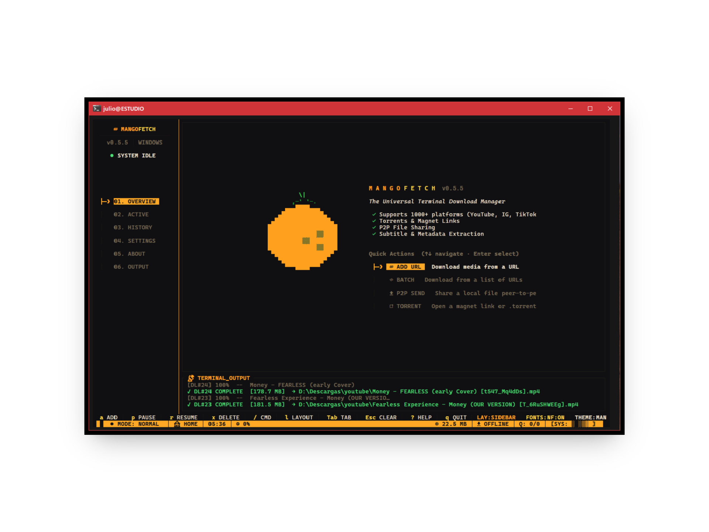
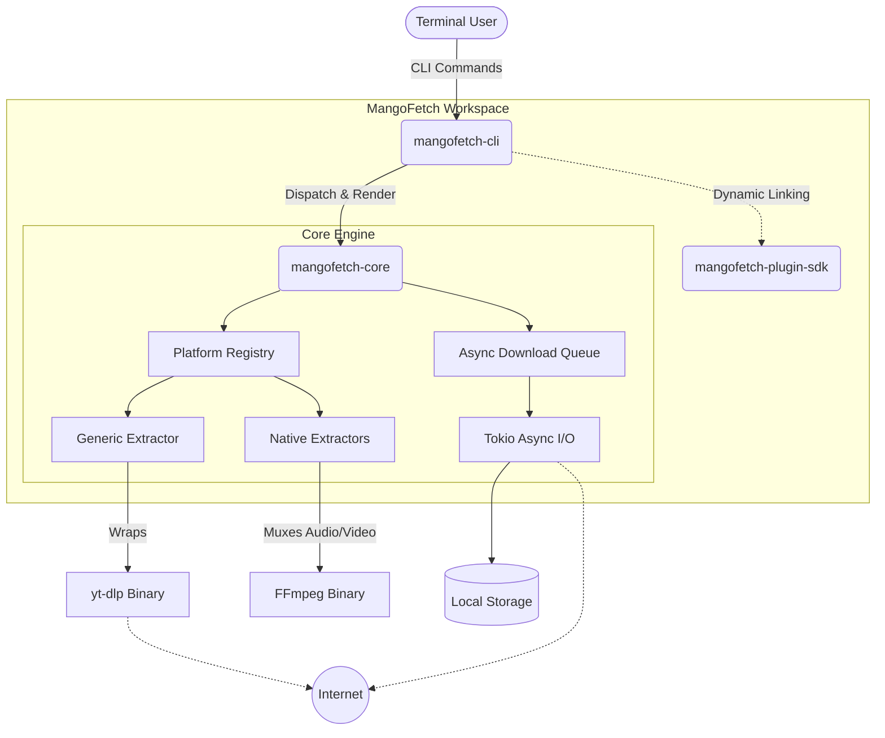
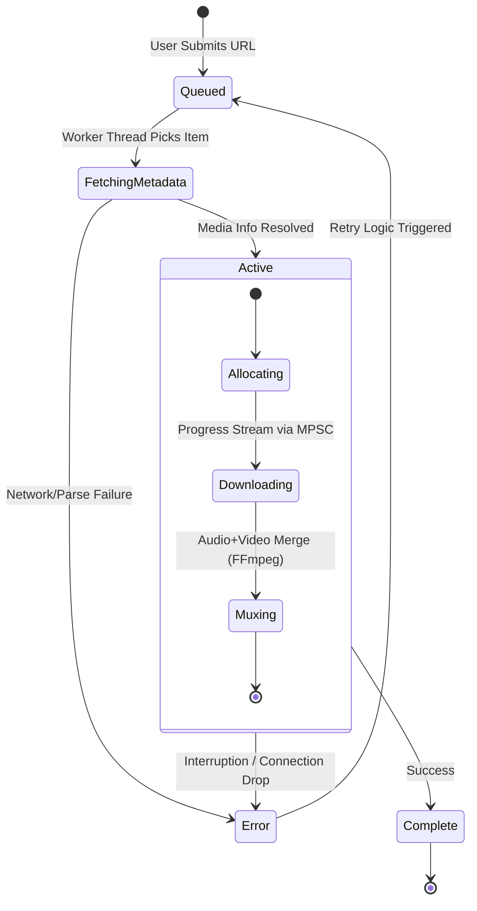

# 🥭 mangofetch

**Brutally fast. Extensible. Pure Rust.**  
_A high-performance, asynchronous download engine for the terminal._
---
<p align="center">
  
</p>

<p align="center">
  <a href="https://crates.io/crates/mangofetch-cli"></a>
  <a href="LICENSE"></a>
  
  
  
</p>

## Overview

**MangoFetch** is a highly concurrent, memory-safe media download engine. Built on top of **Tokio** and **Reqwest**, it is designed to maximize network throughput and handle massive archival batches without blocking the main thread. 

As of **v0.5.0**, MangoFetch features a professional-grade **TUI (Terminal User Interface)** with tropical fruit themes, mouse support, and an advanced dynamic settings engine.

---

## 🛠️ Installation

### Via Cargo (Recommended)

The fastest way to install the CLI directly to your system path:

```zsh
cargo install mangofetch-cli
```

### From Source

For developers who want the absolute bleeding edge or wish to modify the core:

```zsh
git clone https://github.com/julesklord/mangofetch-cli.git
cd mangofetch-cli
cargo build --release
# The compiled binary will be available at: target/release/mangofetch
```

---

## ✨ Key Features (v0.5.0)

*   **1000+ Platforms**: Deep integration with `yt-dlp` to support almost every video site.
*   **Interactive TUI**: A full-screen dashboard with **Tropical Fruit Themes** (Mango, Pitaya, Guayaba, and more!).
*   **Mouse Support**: Scroll through queues and click tabs directly in your terminal.
*   **Vim-Style Commands**: Power users can use `:` commands for ultra-fast operations.
*   **P2P & Torrents**: Native support for magnet links and peer-to-peer file sharing.
*   **Smart Engine**: Multi-segment downloads, staggered starts, and automatic metadata embedding.

---

## 🏗️ Technical Architecture

MangoFetch is organized as a modular workspace, ensuring strict separation of concerns. This allows the core engine to be portable and highly testable, while the CLI remains a thin rendering layer.



### Components

- **`mangofetch-core`**: The UI-agnostic engine. It manages the asynchronous download queue, handles connection pooling, and contains the platform-specific extractors (native parsers for YouTube, Instagram, TikTok, etc.). It intelligently wraps `yt-dlp` and `ffmpeg` for complex media streams, automatically provisioning these binaries if they are missing.
- **`mangofetch-cli`**: A lightweight frontend built with `clap`. It acts as a thin dispatcher that consumes the core library, rendering real-time progress via a brutalist, information-dense ANSI interface.
- **`mangofetch-plugin-sdk`**: A robust FFI-compatible SDK designed for extending MangoFetch's capabilities dynamically via shared libraries (`.so` / `.dll`).

---

## ⚙️ The Core Engine Lifecycle

The `mangofetch-core` queue is fault-tolerant. If a single item in a 1,000-item batch fails, the queue continues processing, aggregating failures for the final summary.



### Key Engineering Features

- **Asynchronous I/O Pipeline:** Utilizing `tokio::sync::mpsc` channels for non-blocking progress reporting. The UI thread is completely decoupled from the I/O threads.
- **Self-Healing Dependencies:** Automatic resolution, downloading, and path-linking of external binaries (`ffmpeg`, `yt-dlp`). The user never has to touch their `$PATH`.
- **Intelligent Parsers:** The Platform Registry attempts to natively parse media (saving overhead) before falling back to generic extractors.

---

## 🕹️ Command Reference

For a complete breakdown of all commands, flags, and TUI shortcuts, please visit our **[Official Wiki](docs/wiki/Home.md)**.

*   🚀 **[Installation Guide](docs/wiki/Installation.md)**
*   🛠️ **[CLI Command Reference](docs/wiki/CLI-Guide.md)**
*   🖥️ **[TUI Interactive Guide](docs/wiki/TUI-Experience.md)**
*   🏗️ **[Technical Architecture](docs/wiki/Architecture.md)**

| Full Command                          | Short Alias _(Upcoming)_ | Description                                             |
| :------------------------------------ | :----------------------- | :------------------------------------------------------ |
| `mangofetch download <url>`           | `mango d <url>`          | Single file download and extraction.                    |
| `mangofetch download-multiple <file>` | `mango dm <file>`        | Batch archival from a text file (supports concurrency). |
| `mangofetch info <url>`               | `mango i <url>`          | Inspect media metadata without touching disk.           |
| `mangofetch list`                     | `mango ls`               | View current queue and historical download status.      |
| `mangofetch clean`                    | `mango c`                | Clear download history and purge cache.                 |
| `mangofetch config`                   | `mango cfg`              | Manage application settings (connections, paths).       |
| `mangofetch check`                    | `mango ch`               | Verify system dependencies (`yt-dlp`, `ffmpeg`).        |
| `mangofetch update`                   | `mango up`               | Update internal dependency binaries to latest versions. |
| `mangofetch logs`                     | `mango log`              | Tail raw application logs for debugging.                |
| `mangofetch about`                    | `mango a`                | Display version, license, and lineage information.      |

---


## 🗺️ Roadmap & Milestones

| Version    | Status | Milestone                                                       |
| ---------- | ------ | --------------------------------------------------------------- |
| **v0.1.0** | ✅     | Initial release and architecture setup                          |
| **v0.2.0** | ✅     | Standalone rewrite — GUI removed, core refactored               |
| **v0.3.1** | ✅     | Rebranding cleanup, test fixes, and documentation overhaul      |
| **v0.4.0** | ✅     | **The TUI Release:** Full-screen interactive terminal interface |
| **v0.5.0** | ✅     | **UX & Polish:** Tropical themes, mouse support, dynamic settings |
| **v0.6.0** | ⏳     | Plugin management and community extractors via SDK              |
| **v0.7.0** | ⏳     | Decentralized P2P file sharing implementation                   |

---

## 🤝 Acknowledgments

- **[OmniGet](https://github.com/tonhowtf/omniget)** — The absolute backbone of this project. A huge shoutout to _tonhowft_ for architecting the original extraction logic and queue engine that MangoFetch builds upon.
- **[yt-dlp](https://github.com/yt-dlp/yt-dlp)** — The incredible extraction engine handling the heavy lifting for over a thousand unsupported platforms.

## Contributing

Pull requests are fiercely welcomed. For major architectural changes, please open an issue first to discuss your approach. See `CONTRIBUTING.md` for guidelines.

## License

<p align="center">
  Built with 🦀 and 🥭 by <a href="https://github.com/julesklord">Jules Martins</a>.<br>
  Licensed under the GPL-3.0 License.
</p>
